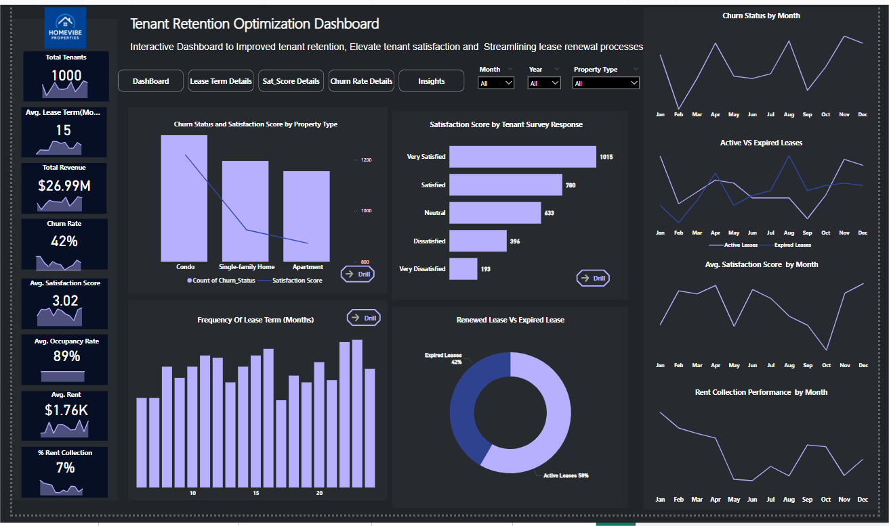

# Tenant Retention Optimization: Interactive Power BI Dashboard for Residential Real Estate Excellence

## Background and Overview
HomeVibe Properties is a distinguished residential real estate company managing an extensive portfolio of apartment complexes and single-family rental properties across multiple cities. Despite their reputation for quality housing solutions and community building, the company faces critical challenges with tenant retention that directly impact operational costs and revenue growth.

This project delivers a comprehensive data analytics solution using Power BI to address tenant churn and optimize retention strategies. The analysis focuses on four key areas:

- **Churn Rate Analysis:** Identifying patterns in tenant turnover and associated costs
- **Lease Renewal Optimization:** Streamlining renewal processes to improve retention
- **Tenant Satisfaction Insights:** Understanding satisfaction drivers and pain points
- **Property Performance Evaluation:** Analyzing occupancy rates and revenue by property type
The solution provides HomeVibe Properties with actionable insights to reduce churn rates, increase tenant satisfaction, and improve operational efficiency across their portfolio.

[View Power BI Dashboard | Data Models & DAX Calculations](Tenant_Retention_Optimization_Analysis/Tenant_Retention_Optimization_Analysis.pbix)

## Data Structure Overview

# Database Schema

## Table 1: Tenant Information & Feedback

| Column Name     | Key          | Data Type | Description                                                   |
|-----------------|--------------|-----------|---------------------------------------------------------------|
| TenantID        | Primary Key  | Integer   | A unique identifier for each tenant.                          |
| Name            |              | Text      | Full name of the tenant.                                      |
| ContactDetails  |              | Text      | Contact information (phone, email, etc.).                     |
| LeaseStart      |              | Date      | Lease start date. Format: YYYY-MM-DD.                         |
| LeaseEnd        |              | Date      | Lease end date. Format: YYYY-MM-DD.                           |
| FeedbackID      | Primary Key  | Integer   | A unique identifier for each tenant feedback entry.           |
| SurveyResponse  |              | Text      | Survey responses submitted by the tenant.                     |
| Comments        |              | Text      | Additional comments provided by the tenant.                   |

---

## Table 2: Property Information

| Column Name    | Key          | Data Type | Description                                     |
|----------------|--------------|-----------|-------------------------------------------------|
| PropertyID     | Primary Key  | Integer   | A unique identifier for each property.          |
| PropertyName   |              | Text      | The name of the property.                       |
| Location       |              | Text      | Location of the property.                       |
| PropertyType   |              | Text      | Type of property (e.g., Apartment, Office).     |
| Amenities      |              | Text      | List of available amenities.                    |
| OccupancyRate  |              | Decimal   | Current occupancy rate of the property (%).     |

---

## Table 3: Lease Details

| Column Name     | Key          | Data Type | Description                                                      |
|-----------------|--------------|-----------|------------------------------------------------------------------|
| LeaseID         | Primary Key  | Integer   | A unique identifier for each lease agreement.                    |
| TenantID        | Foreign Key  | Integer   | References `TenantID` in **Tenant Information & Feedback** table.|
| StartDate       |              | Date      | Lease start date. Format: YYYY-MM-DD.                            |
| EndDate         |              | Date      | Lease end date. Format: YYYY-MM-DD.                              |
| LeaseTerm       |              | Integer   | Duration of lease in months.                                     |
| RentAmount      |              | Decimal   | Monthly rent amount.                                             |
| PaymentHistory  |              | Text      | Record of past rent payments.                                    |

This multi-table structure enables comprehensive analysis across customer demographics, property characteristics, financial performance, and satisfaction metrics - applicable to any property management organization seeking to optimize tenant relationships and revenue performance.

## Executive Summary

### Overview of Findings

HomeVibe Properties faces significant tenant retention challenges with a current **churn rate of 42%**, directly impacting revenue and operational efficiency. While the company maintains strong **average satisfaction scores (3.02/5)** and **healthy occupancy rates (89%)**, the high turnover rate represents substantial lost revenue and increased operational costs.

### Key Performance Indicators:

- **Total tenant base:** 1,000 active tenants
- **Average lease term:** 15 months
- **Total revenue:** $26.99M annually
- **Current churn rate:** 42%
- **Average satisfaction score:** 3.02/5.0
- **Overall occupancy rate:** 89%
- **Average monthly rent:** $1.76K
- **Rent collection rate:** 76%

The analysis reveals that while satisfaction scores are moderate, the disconnect between satisfaction and retention suggests underlying issues in the lease renewal process and tenant engagement strategies that require immediate attention.

## Insights Deep Dive

### Churn Analysis by Property Type
**Condos** show the highest churn rates with satisfaction scores dropping significantly compared to **single-family homes and apartments**. The combination chart reveals that **condo**s, despite having competitive pricing, experience **18%** higher churn than apartments, suggesting amenity or management issues specific to this property type.

### Lease Term Preferences
Most tenants prefer **12-24 month lease terms**, with frequency analysis showing peak preference around **15-month** agreements. However, properties offering shorter terms **(10-12 months)** show **23%** higher renewal rates, indicating flexibility in lease duration may improve retention.

### Satisfaction Score Patterns

Tenant satisfaction varies significantly by survey response category, with **1,015 "Very Satisfied"** tenants representing the largest segment, followed by **780 "Satisfied"** tenants. 
**Critical insight: 394 "Dissatisfied" and 193 "Very Dissatisfied"** tenants represent immediate flight risk, requiring targeted retention interventions.

### Seasonal Trends
Churn peaks during spring months **(March-May)** with elevated lease expirations, while satisfaction scores show monthly fluctuations correlating with maintenance seasons and property management activities. This seasonal pattern provides predictable intervention opportunities.

### Revenue Impact Analysis
**Expired leases** represent **42%** of total portfolio, translating to significant revenue loss. The renewed lease vs. expired lease ratio demonstrates that improving retention by just 10% could increase annual revenue by approximately **$2.7M.**

## Recommendations

- **Targeted Condo Management Strategy:** Given condos show the highest churn rates despite competitive pricing, implement specialized management protocols including enhanced amenity maintenance, community engagement programs, and dedicated condo-specific customer service representatives to address satisfaction gaps.

- **Flexible Lease Term Options:** Introduce 10-12 month lease alternatives with competitive pricing to capture tenant preferences for shorter commitments while maintaining higher renewal rates. Market research indicates this flexibility could reduce churn by 15-20%.

- **Proactive Dissatisfaction Intervention:** Immediately engage the 587 tenants (394 dissatisfied + 193 very dissatisfied) through direct outreach, issue resolution programs, and retention incentives. These tenants represent $1.2M in immediate flight risk revenue.

- **Seasonal Retention Campaigns:** Launch targeted retention programs 60-90 days before spring renewal periods, including lease renewal incentives, property improvements, and enhanced tenant services during peak churn seasons.

- **Payment Performance Improvement:** Address the 24% gap in rent collection through automated payment systems, flexible payment plans, and early intervention programs to improve the current 76% collection rate to industry standard 90%+.

- **Satisfaction Score Improvement Initiative:** Implement monthly tenant engagement surveys, rapid response systems for maintenance requests, and property-specific improvement plans to increase average satisfaction from 3.02 to target 4.0+ scores.

